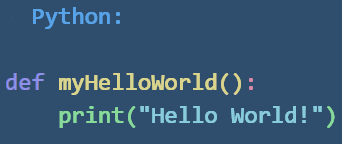
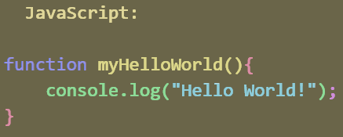
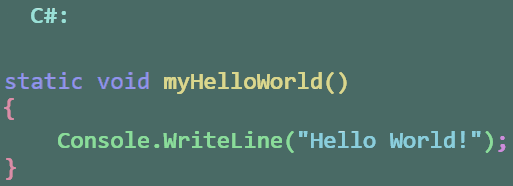

## I. Syntax

Die Syntax beschreibt die Regeln einer Programmiersprache, um kompilierbar respektiv interpretierbar zu bleiben. Unterschiedliche Programmiersprachen mögen sich hier in vielen Facetten ähneln, und in anderen Unterscheiden. Für den Programmierer ist es wichtig die Syntax seiner gewählten Programmiersprache zu verstehen, um sie tatsächlich anwenden zu können.  

Beispielhaft hierzu ein sogenanntes "Hello World" Programm in Python, JavaScript und C#.
 

 

In folgenden Beispielen wird C#-Syntax verwendet.