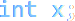
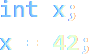
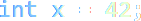
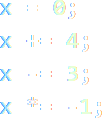

## II. Variablen
> 

Variablen sind Behältnisse für Werte und elementärer Bestandteile jeder Programmiersprache.  

Im Beispiel wird durch x unsere Variable beschrieben. Der Name der Variable selbst wird hierbei "Bezeichner" genannt. 

Durch das "=" wird der Variablen der rechtsstehende __Wert__ zugeordnet: 42.

In der Regel obliegt die Benennung von Variabeln dem Programmierer, jedoch gibt es _good practices_ und _style guidelines_ um Code lesbar zu halten, möglicherweise weiterhin auch vom Arbeitgeber vorgegebene _best practices_ die eingehalten werden sollten.

### 1. Deklaration
>  

Eine Variablendeklaration beinhaltet das Benennen und Erstellen einer Variablen. Hierbei ist es für streng typisierte Sprachen notwendig auch den Datentyp anzugeben, im Falle des Beispiels __int__ für Integer _(Ganzzahl)_.  

Bevor mit der deklarierten Variablen jedoch operiert werden kann, muss sie in jedem Fall noch initialisiert werden.

### 2. Initialisierung
> 

Das Initialisieren ist das erste Zuweisen einer Variablen zu einem Wert. Um einer Variablen einen Wert zuweisen zu können, muss sie zuvor, wie im Beispiel, deklariert werden.  

Möglich ist jedoch auch die Deklaration und Initialisierung in Kurzform zu schreiben:

> 

Dieses Beispiel ist funktionsgleich mit dem ersten.

### 3. Zuweisung
> 

Beliebig viele Zuweisungen dürfen der Initialisierung folgen. Im Beispiel sind vier aufeinanderfolgende Zuweisungen angegeben.
