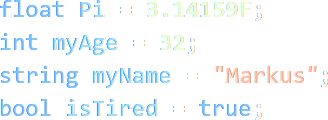

## III. Datentypen
> 

Daten erscheinen in manigfaltiger Form. Um sie interpretierbar zu machen, werden __Datentypen__ genutzt, die Regeln zur Form und zulässigen Operationen als auch spezielle Methoden beinhalten.  

Je nach Programmiersprache, können sich die nutzbaren Datentypen unterscheiden. Im Beispiel angeführt sind Datentypen, die in jeder geläufigen Programmiersprache verwendet werden können.