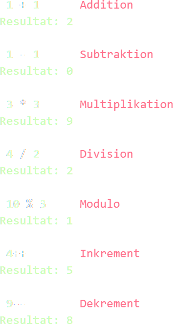
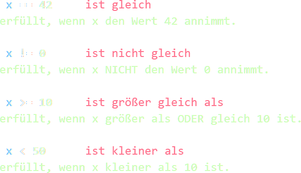
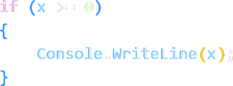
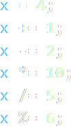
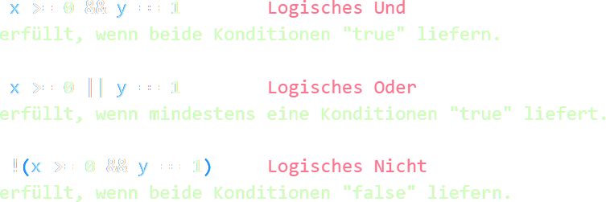
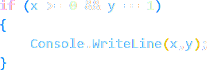

## IV. Operatoren
Eine Operation bedingt immer mindestens zwei Elementen _(Operanden)_. Die Operation selbst kann dabei grundsätzlich __arithmetischer__, __vergleichender__, __zuweisender__ oder __logischer__ Natur sein.

### 1. Arithmetische Operatoren
> 

#### CODEBEISPIEL:
>  

Arithmetische Operatoren beinhalten immer mindestens die vier Grundrechenarten und den __Modulo__-Operator. Im Beispiel sind auch die zwei C-Sprachen-typischen __Inkrement__- und __Dekrement__-Operatoren aufgeführt. 

Ihre Funktion ist das mathematische Berechnen der Operanden.

### 2. Vergleichsoperatoren
> 

#### CODEBEISPIEL:
> 

Eine vollständige Vergleichsoperation ist synonym mit einer __Kondition__, und liefert so entweder den __Bool__-Wert __true__ oder __false__ zurück.  

Das Einsatzgebiet von Vergleichsoperatoren findet sich in __Kontrollstrukturen__.

### 3. Zuweisungsoperatoren
> 

Neben dem "wahren" Zuweisungsoperator =, handelt es sich bei dem Rest um Kombinationsschreibweisen, die sowohl eine Zuweisung, als auch eine arithmetische Operation vereinen.  

>__ACHTUNG:__   
Es besteht hohe Verwechslungsgefahr zwischen dem Zuweisungsoperator = und dem Vergleichsoperator ==.  
>
>Der Vergleichsoperator == ist hauptsächlich in Kontrollstrukturen anzutreffen,  
der Zuweisungsoperator = hauptsächlich in Anweisungen!  

### 4. Logische Operatoren
> 

#### CODEBEISPIEL:
> 

Logische Operatoren sind, ebenso wie Vergleichsoperatoren, in Kontrollstrukturen anzufinden. Ihre Funktion ist es die Verkettung von Konditionen zu erlauben.
