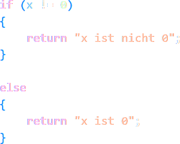
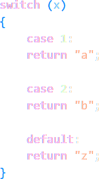
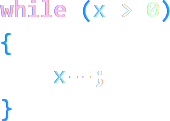
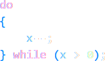
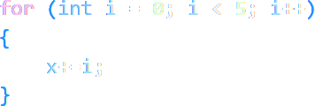

## VI. Kontrollstrukturen

Um den Fluss eines Programms anhand der Prüfung von Bedingungen abhängig zu machen, sind sogenannte __Kontrollstrukturen__ notwendig.

Kontrollstrukturen können in sich selbst jeweils weitere Kontrollstrukturen beherbergen. Man spricht dann von einer __Verschachtelung__.

### 1. Verzweigung
> 

Bei einer Verzweigung (oder __if-Anweisung__), wird die Bedingung geprüft und der nachfolgende Code nur dann ausgeführt, wenn die Bedingung den Wert __true__ annimmt. 

Die __else-Anweisung__, kann in der Regel nur auf eine vorhergehende __if-Anweisung__ folgen, und bestimmt den weiterführenden Code, sollte die if-Bedingung falsch sein. Eine else-Anweisung ist optional, das heißt, sollte es erwünscht sein, kann auch nur nach der Wahrheit der if-Bedingung "gefiltert" werden.

### 2. Fallauswahl
> 

Eine Fallauswahl ist funktionell der Verzweigung ähnlich, prüft jedoch den Wert einer Variablen anstelle den Wahrheitswert einer Bedingung.  

Die Fallauswahl stellt eine elegante wenn auch spezifische Lösung dar. Sie ist einer komplizierten Verschachtelung mehrerer Verzweigungen meist vorzuziehen.  

### 3. Kopfgesteuerte Schleife
> 

Die kopfgesteuerte Schleife prüft schon vor Beginn ihrer Iterationen _(Wiederholungen)_, und danach vor Beginn einer jeden Iteration, nach dem Wahrheitswert der Bedingung. Im Falle von __false__, wird sie also übersprungen.  

Im Falle von __true__, werden die Anweisungen innerhalb der Schleife solange wiederholt, bis ihre Bedingung __false__ wird.  

Im Beispiel, wird also x um 1 dekrementiert bis x den Wert 0 annimmt.

### 4. Fußgesteuerte Schleife
> 

Die fußgesteuerte Schleife überprüft den Wahrheitswert ihrer Bedingung erst am Ende einer Iteration. Das hat zur Folge, dass sie immer __mindestens__ ein Mal ausgeführt wird und __nicht__ übersprungen werden kann.

### 5. Zählergesteuerte Schleife
> 

Die zählergesteuerte Schleife ist eine Variation der kopfgesteuerten Schleife, und iteriert durch eine Menge von Zahlen oder anderen Elementen.

Im Beispiel wird zuerst eine Variable i mit dem Startwert (hier: 0) initialisiert:  

_int i = 0_  

als nächstes wird der Endwert bestimmt:  

_i > 5_

und zum Schluss die Schrittweite der Iterationen bestimmt. In diesem Fall eine Inkrementierung um 1: 

_i++_
