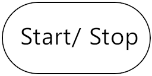
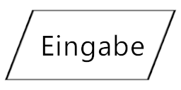
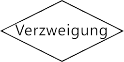
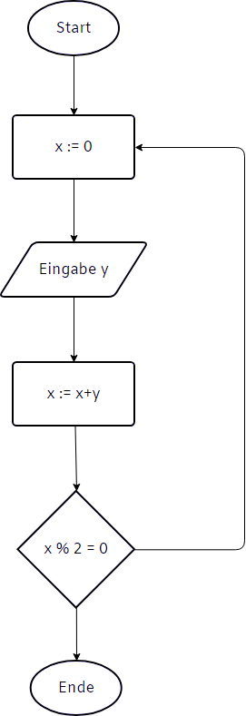

# Programmablaufplan (_Flowchart_)

Um Programmflüsse darzustellen, müssen Kontrollstrukturen in leicht verständlicher Form vermittelt werden.  
 
Ein intuitives, wenn auch schnell an Komplexität zunehmendes Instrument, kann hier der Programmablaufplan (auch: _Programmstrukturplan_ oder _Flowchart_/ _Flussdiagramm_) liefern.

## Elemente
### Terminator

* Oval 
* Beginn und Ende des Programms. 

### Operation

* Quader
* Anweisung/ Operation (Bsp.: __x:=42__)

### Benutzereingabe/ Bildschirmausgabe

* Parallelogramm
* Liest bei __Eingabe__ ein
* Gibt bei __Ausgabe__ aus

### Verzweigung

* Raute
* Ja/ Nein-Entscheidung
* __2__ abgehende Verbindungen

### Verbindung

* Pfeil
* verbindet zwei Elemente
  
## Vorteile
* Gutes Planungsinstrument für Grobübersichten
* Von Laien leicht verständlich

## Nachteile
* GoTo-Abkürzungen verleiten zu Unachtsamkeiten.
* Schleifen müssen aus kleineren Elementen gebaut werden.

>## Beispiel
> Das Programm soll nur bei Eingabe einer geraden Zahl beendet werden. Bei Eingabe einer ungeraden Zahl, soll es wiederholt werden.  
> 
> 