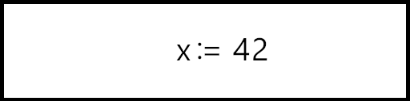
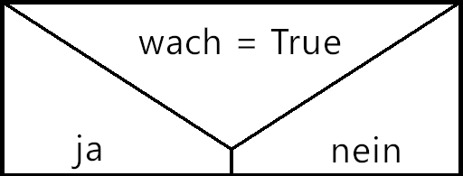
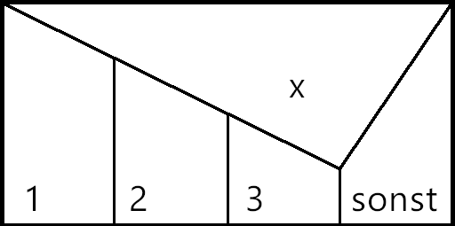
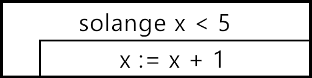
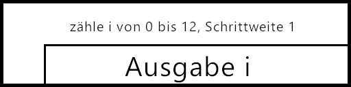
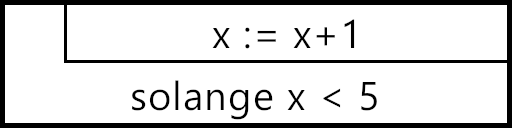
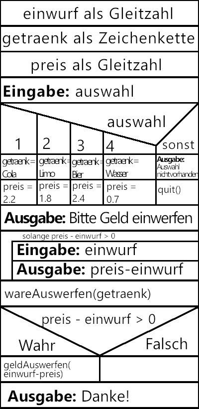

# Struktogramm (_Nassi-Shneiderman-Diagramm_)

In der Hoffnung Flowcharts im Bereich der Programmierung durch besser geeignete Sinnbilder zu ersetzen, entwickelten Isaac Nassi und Ben Shneiderman 1972 das __Struktogramm__ (oder eben: _Nassi-Shneiderman-Diagram_).  

Mithilfe des Struktogramms war es nun möglich komplexe Kontrollstrukturen wie __Fallauswahlen__, __kopf-__ und __fußgesteuerte Schleifen__ als auch verschachtelte Kontrollstrukturen darzustellen, ohne die Lesbarkeit des Diagrams zu sehr zu benachteilen.

## Elemente
### Anweisung

* Zuweisungsoperator "__:=__", um Variablen zu deklarieren/ zuzuweisen.
* Anweisung kann auch Eingabe oder Ausgabe sein (Bsp: __Ausgabe: zahl__).

### Bedingung

* Vergleichsoperator "__=__" um Werte zu vergleichen.

  
### Fallauswahl

* Auch durch geschachtelte Bedingungen darstellbar.

  
### Kopfgesteuerte Schleife

* in Programmiersprachen häufig als __while__-Schleife benannt.

### Zählergesteuerte Schleife

* in Programmiersprachen häufig als __for__-Schleife benannt.

### Fußgesteuerte Schleife

* in Programmiersprachen häufig als __do while__-Schleife benannt.
  
## Vorteile
* Ausmaß von Iterationen und Konditionalen ist leicht ersichtlich.
* Übt im besonderen Ausmaß Programmlogik zu schreiben.

## Nachteile
* Bei zunehmender Schachtelung unübersichtlich.
* nur bedingt möglich __Objektorientierung__ zu realisieren.

>## Beispiel
>Ein Programm welches bei Eingabe einer Nummerntaste das zugehörige Getränk ausgeben soll.  
>
>
