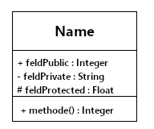
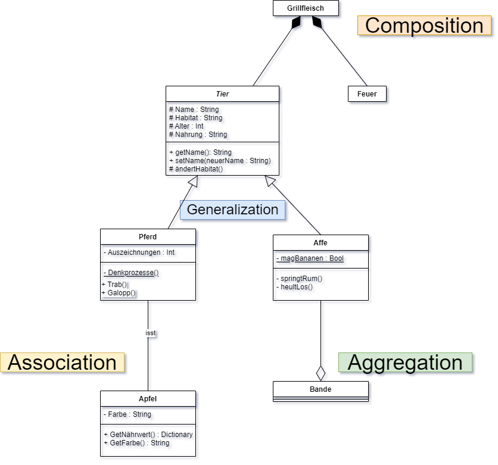

# UML Klassendiagramm

Im Zuge der zunehmend an Bedeutung gewinnenden Objektorientierung, ist es notwendig komplexe Abhängigkeiten zwischen Klassen, ihren Methoden und Feldern grafisch darstellbar zu machen.

Die Unified Modelling Language _(UML)_ ist eine grafische Modellierungssprache, die es neben anderen Diagrammarten auch ermöglicht Klassenabhängigkeiten verständlich darzustellen.
 
## Elemente
### Klassen

* Gegliedert in 1 - 3 Sektoren.
* beinhaltet durch horizontale Linien getrennt: __Klassenname__, __Attribute__ und __Operationen__.
* Klassen können ohne __Attribute__ oder __Operationen__ auftreten, nicht jedoch ohne __Klassennamen__.

#### Klassenname

* __Bezeichner__ der Klasse
* Format: _Klassenname_
* überhalb des Klassennamens können Schlüsselwörter (bsp: << Interface >>) in doppelten spitzen definiert sein.
* unterhalb des Klassennamens können Eigenschaften (bsp: (abstract) )in einfachen Klammern definiert sein.
* notwendiger Bestandteil!

#### Attribute

* __Feld__.
* Format: _bezeichner : datentyp = wert_
* Unterstrichene Attribute sind __Klassenvariablen__.

#### Operationen

* __Methode__.
* Format: _bezeichner(parameter1 : datentyp, parameterN : datentyp) : rückgabewert_
* Unterstrichene Operationen sind __Klassenmethoden__.

#### Sichtbarkeit

Sichtbarkeit der Attribute und Operationen wird durch folgende Symbole markiert:

__+__ Public
  * jede andere Klasse hat uneingeschränkten Zugriff.  
  
__#__ Protected  
  * Nur Unterklassen haben Zugriff.  
  
__-__ Private   
  * Nur selbe Klasse hat Zugriff.

### Beziehungen

#### Assoziation

* keine Pfeilspitze.
* arbiträre Beziehung.
  
#### Generalisierung

* unausgefüllte Dreieckspfeilspitze.
* Vererbungsbeziehung.
* Speziellere Klasse _(Kindklasse)_ erbt von generellerer Klasse _(Elternklasse)_.
* Pfeilspitze von speziellerer Klasse zur generelleren Klasse gerichtet.

#### Aggregation

* unausgefüllte Viereckspfeilspitze.
* Teil-Ganzes Beziehung.
* Pfeilspitze von Einzelteilklasse zur ganzheitlichen Klasse gerichtet.
  
#### Komposition

* ausgefüllte Viereckspfeilspitze.
* Teil-Ganzes Beziehung.
* Teile __können nicht__ ohne Ganzes existieren (Bsp.: Raum ohne Gebäude).
* Pfeilspitze von Einzelteilklasse zur ganzheitlichen Klasse gerichtet.

#### Kardinalitäten

Um die Menge der Einzelteile bei __Aggregation__ und __Komposition__ in Beziehung zum Ganzen zu setzen, oder aber bei einer Assoziation das Mengenverhältnis der Klassen zu beschreiben, kann durch __min__..__max__ (Bsp.: 1..n) die mögliche Menge an den jeweiligen Pfeilseiten beschrieben werden.
  
>## Beispiel
> Abstrakte Beschreibung grober Beziehungen von Tieren.
> 
> 
